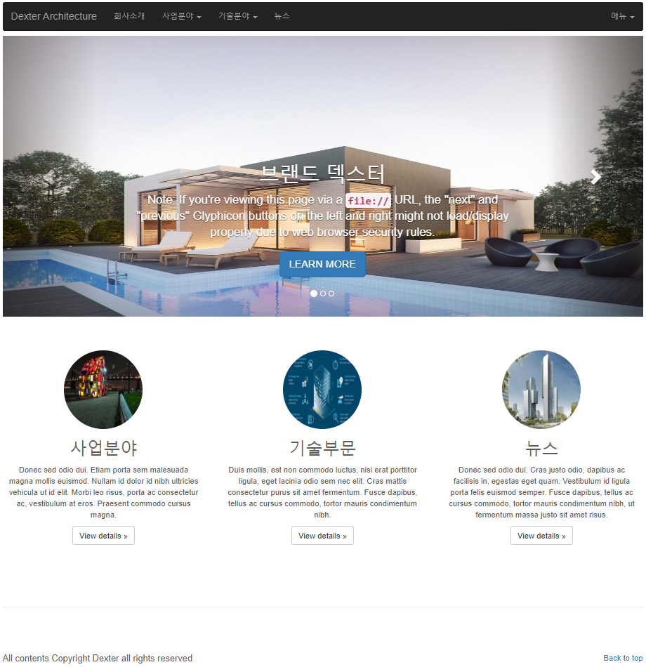

# Construction company WebSite
{: width="75%" height="75%"}

### Environment
1. java8
2. tomcat9.0
3. spring 5.0.7
4. oracle11g(DB), HikariCP(DBCP)
5. css, js : [bootstrapk] http://bootstrapk.com/

---------------------------------------

### pattern(MVC -> Spring 5Layer)

#### MVC
- View
  - Controller
    - Command
      - DAO
        - DTO

#### Spring 5Layer
- View(Presentation Layer)
  - Controller(Control Layer)
    - Command and Service(Business Logic Layer)
      - Mapper(Persistence Layer)
        - DTO(Domain Model Layer)
        
---------------------------------------

